# HOW TO HOST A STATIC WEBSITE USING S3 AND DISTRIBUTE USING CLOUDFRONT ON AWS

#### __Services Required__
#### - S3 - to create bucket and upload source code
#### - Cloud front -AWS global content delivery network, that speeds up distribution of your static and dynamic web content (such as .html, .css, image and .js files) to your users   
#### __Steps__
#### 1. Login to your AWS account, from the management console's home page, search for s3 using the searchbar or from recently visited or from list of favorites (click on s3)
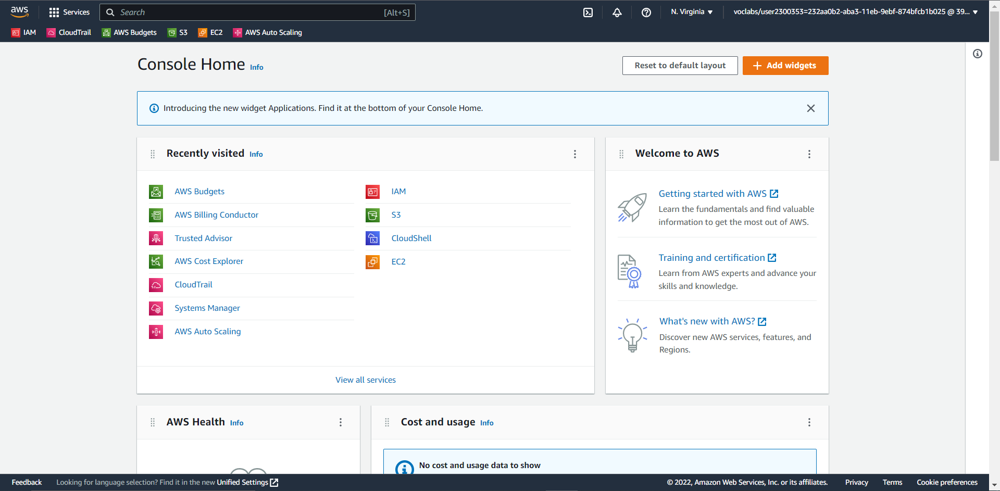
#### 2. On s3 dashboard, click the create bucket button to create a bucket
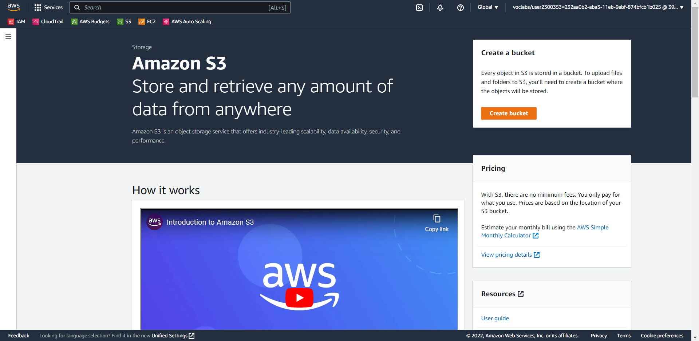
#### 3. Name bucket (a unique global name)
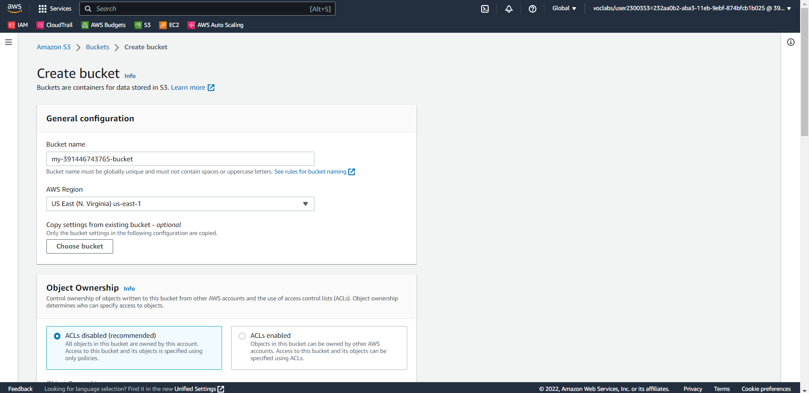
#### 4. Disable block public access settings for this bucket, so as to make this bucket publicly visible, then acknowledge.
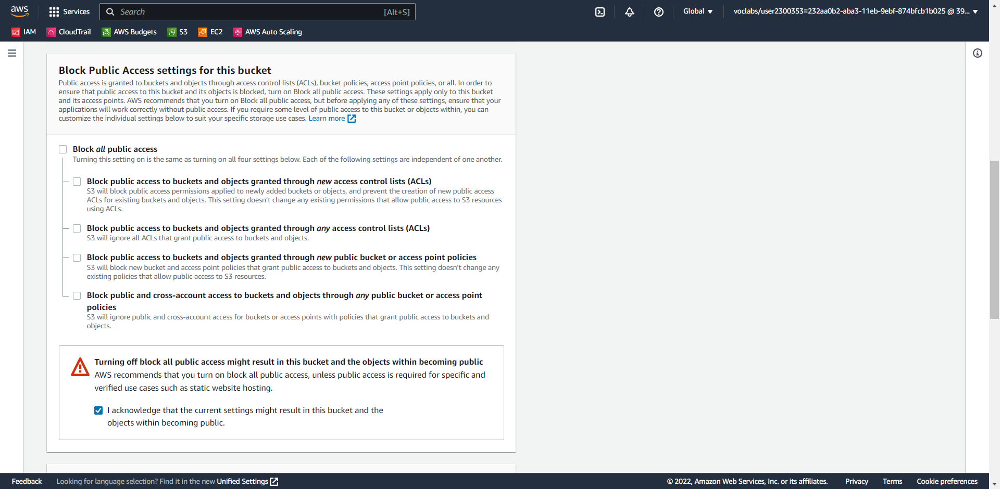
#### 5. Bucket is created
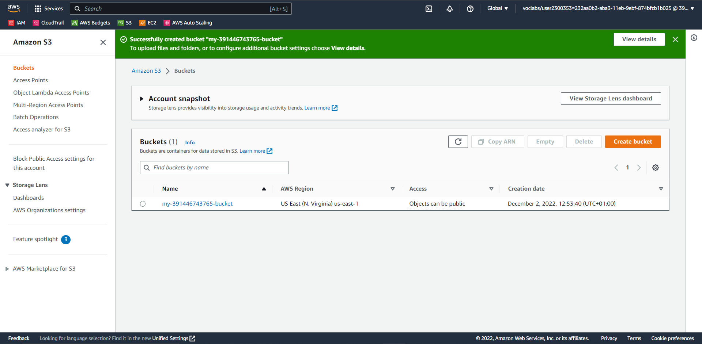
#### 6. Upload source code (either via drag and drop or manual upload) to bucket (this took a while because some folders had loads of files)
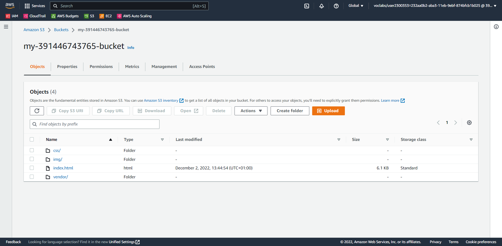
#### 7. Go to permissions tab to secure bucket via IAM
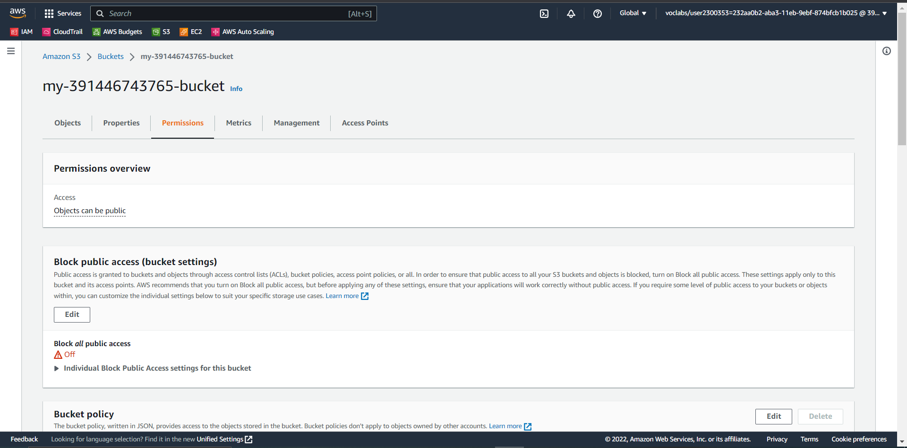
#### 8. Edit bucket policy and ensure resource is the current bucket's name
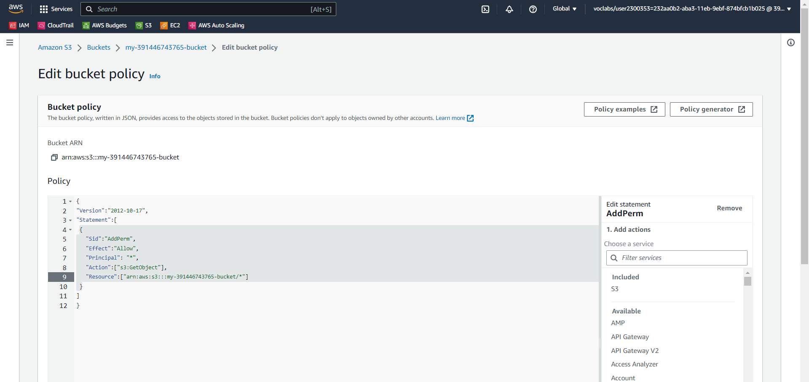
#### 9. Notice this bucket is now __publicly accessible__ (this is required for static website hosting)
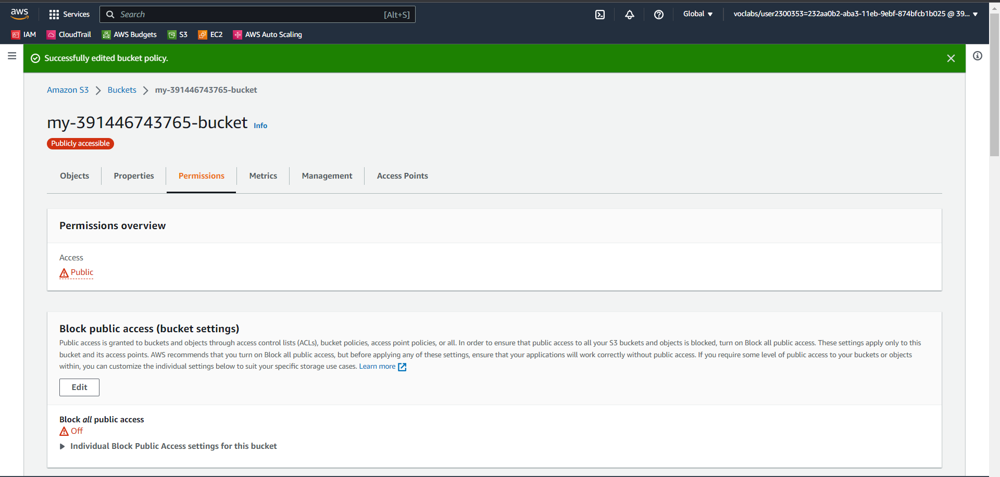
#### 10. Click __edit static website hosting__ and enable static website hosting, then specify your index and error document/page
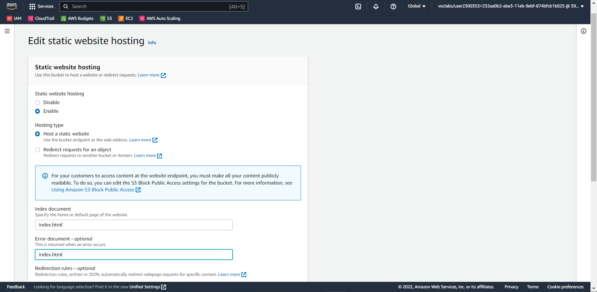
#### 11. Copy bucket website endpoint and paste on a browser
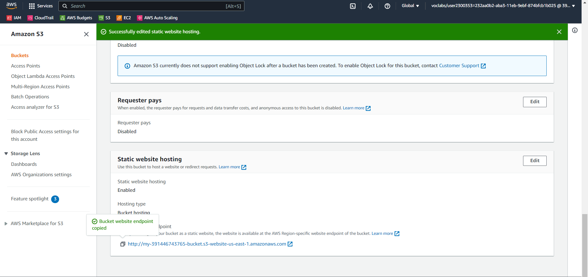
#### 12. Notice that the website is visible using the bucket website endpoint
   
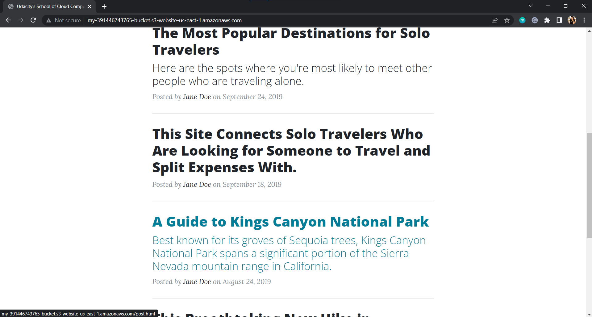
#### 13. Search for cloudfront on the searchbar
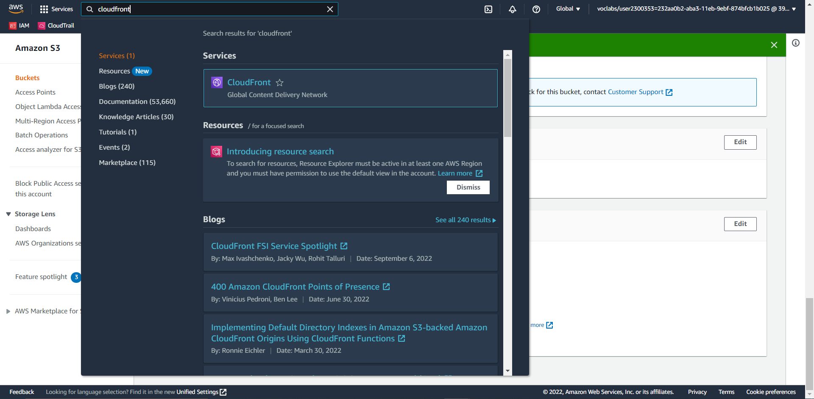
#### 14. On cloudfront's dashboard, create a cloudfront distribution using create a cloudfront distribution
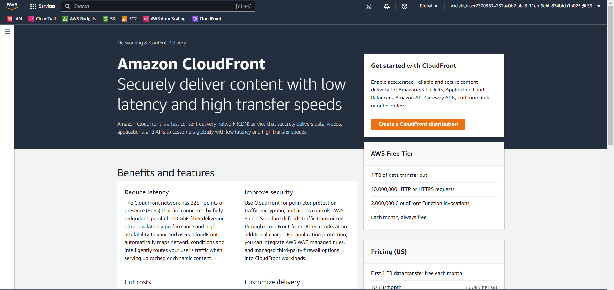
#### 15. Name origin domain __bucket website endpoint__ (do not select from dropdown), leave other fields with their default values
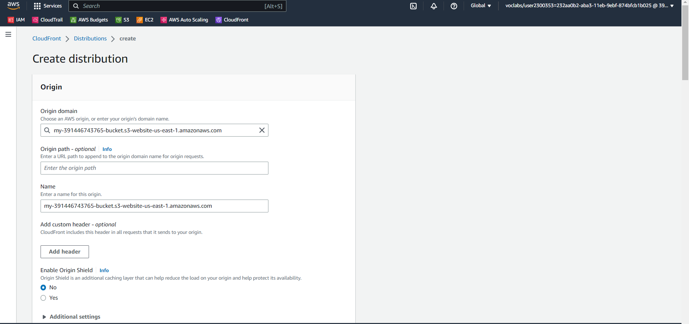  
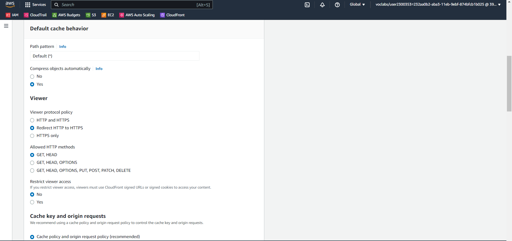  
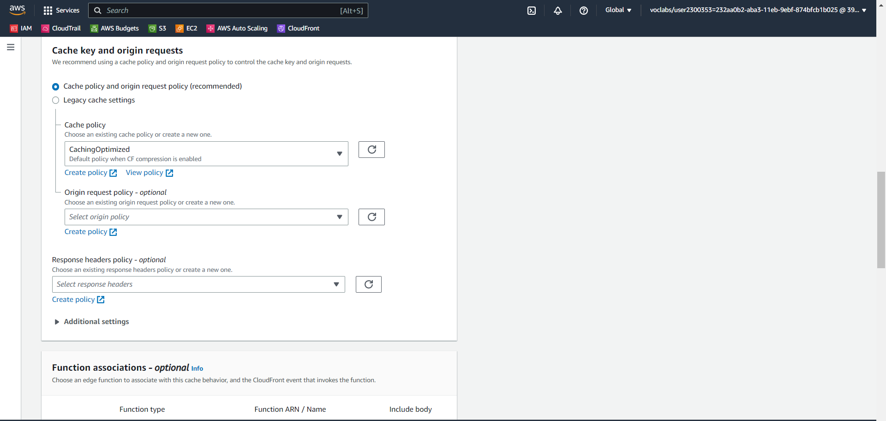
#### 16. Cloudfront distribution has been created, and is still in __deploying__ state
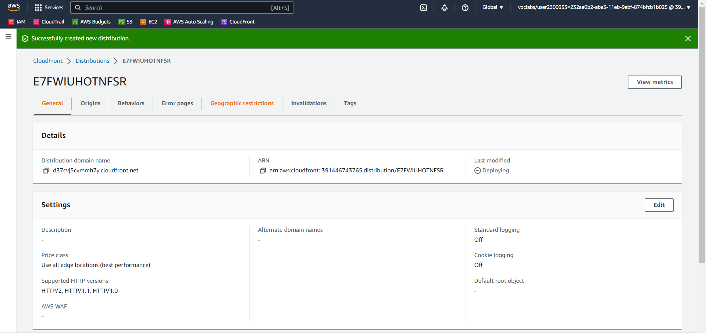
#### 17. Cloudfront state is now in __enabled__ state, copy domain name and paste on the browser

#### __NB: When cloudfront is in an enabled state, it attaches to s3 and starts caching s3 pages (this may take a while), once this is done the cloudfront domain name URL will stop redirecting to the S3 object URL__
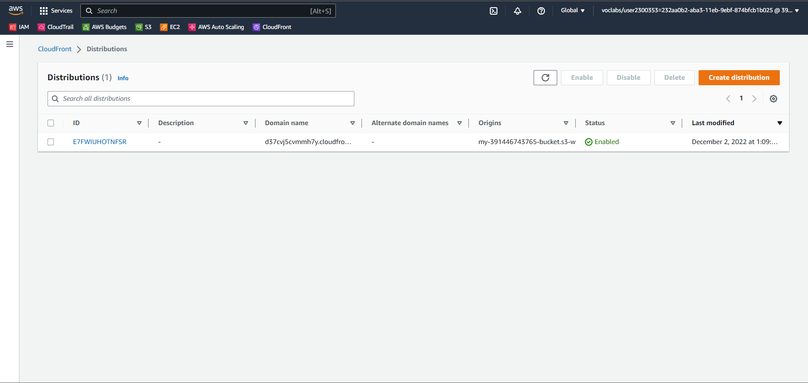
#### 18. The website can be accessed via:
#### __website endpoint__
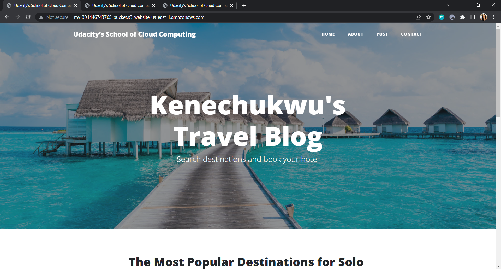
#### __cloudfront URL__
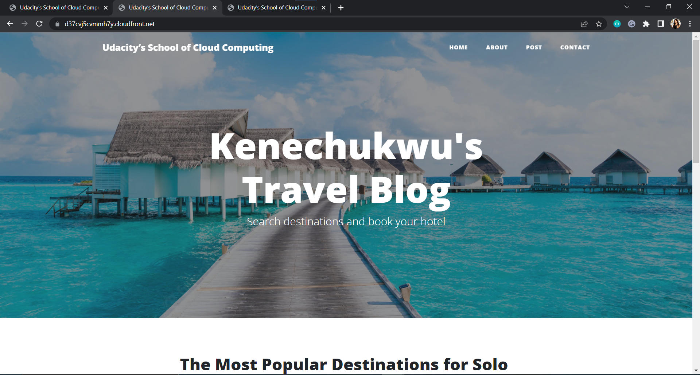
#### __s3 object URL__

#### I cleaned up by deleting the objects (files) in my bucket and deleting my cloudfont distribution.

#### Notice the difference between each URL (note that these url's are currently inactive because the resources have been deleted)
CloudFront endpoint URL: https://d37cvj5cvmmh7y.cloudfront.net/

Website-endpoint : http://my-391446743765-bucket.s3-website-us-east-1.amazonaws.com/

S3 object URL : http://my-391446743765-bucket.s3-website-us-east-1.amazonaws.com/index.html

